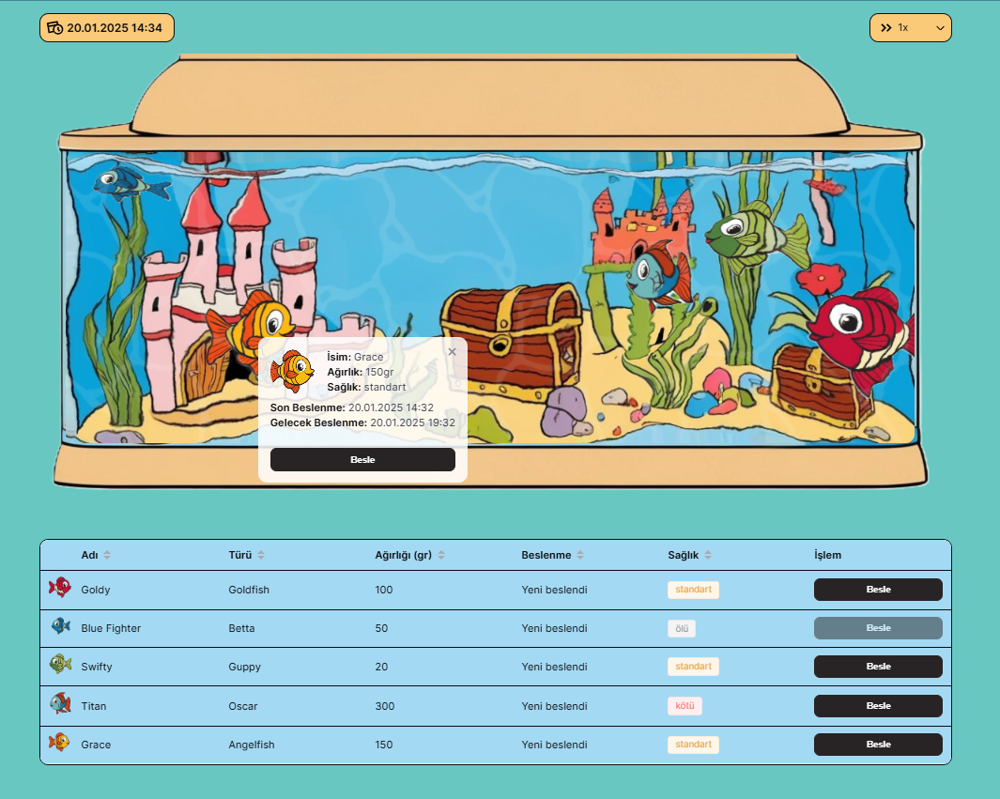

# Akvaryum Takibi Uygulaması
  
  
  Akvaryum Takibi Uygulaması, hayali bir akvaryumdaki balıkların türlerini, isimlerini, ağırlıklarını ve sağlık durumlarını kolayca takip edebilmeniz ve onları beslemeniz için geliştirilmiştir.

## İçindekiler
- [Genel Bakış](#genel-bakış)
    - [Ekran Görüntüsü](#ekran-görüntüsü)
- [Kullanılan Teknolojiler](#kullanılan-teknolojiler)
- [Yazar](#yazar)
- [Proje Kurulumu](#proje-kurulumu)

## Genel Bakış

Akvaryumdaki balıklar kullanıcı tarafından manuel olarak beslenir. Balıkların türüne göre değişebilen beslenme aralığı uygulama tarafından kullanıcıya verilir. Balıkların doğru zamanda doğru miktarda beslenmesinin ve takibinin sağlık durumları için önemli olduğu uygulamada, bu esaslara uyulmaması balığın sağlık durumunu geri dönüşü olmayacak şekilde kötüleşmesine yol açabilir. Vakti değerli kullanıcılar için zamanın akışı hızlandırılarak daha yoğun bir kullanıcı deneyimi yakalanabilen uygulama ile eğlenceli bir şekilde balıkların sağlık durumları ve beslenme takvimleri kontrol edilebilir.

### Live

- https://home-aquarium.vercel.app/

### Ekran Görüntüsü
  

### Kullanılan Teknolojiler

- [Vue3 Composition API](https://vuejs.org/)
- [Pinia](https://pinia.vuejs.org/)
- [Pixi.js](https://pixijs.com/)
- [Element+ UI](https://element-plus.org/en-US/)
- [Vitest](https://vitest.dev/)

## Yazar

- [Pınar Suvaçoğlu](https://www.linkedin.com/in/pinarsuvacoglu/)

## Proje Kurulumu

```sh
npm install
```

### Compile and Hot-Reload for Development

```sh
npm run dev
```

### Compile and Minify for Production

```sh
npm run build
```

### Lint with [ESLint](https://eslint.org/)

```sh
npm run lint
```

## Test

```sh
npm run test
```
